<table>
<tr>
<td valign="top"></td>
<td valign="top"></td>
</tr>
</table>

## Hi, I'm web3m 👋

**ML · Backend · Building useful systems with code**

I'm passionate about machine learning and backend development, with a focus on turning ideas into practical, reliable software.

 

